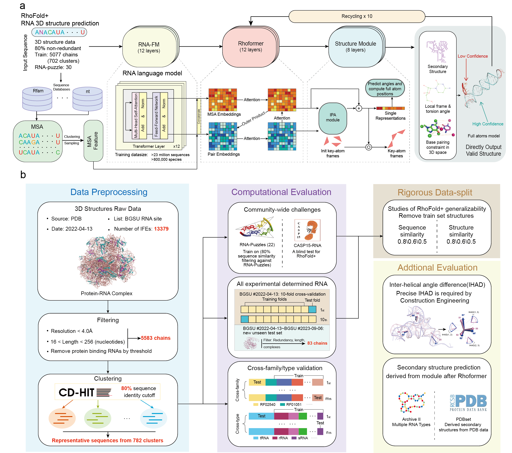

# RhoFold+: Accurate RNA 3D structure prediction using a language model-based deep learning approach



This is the open source code for RhoFold+.

<details><summary>Citation</summary>

```bibtex
@article{shen2022e2efold,
  title={E2Efold-3D: End-to-End Deep Learning Method for accurate de novo RNA 3D Structure Prediction},
  author={Shen, Tao and Hu, Zhihang and Peng, Zhangzhi and Chen, Jiayang and Xiong, Peng and Hong, Liang and Zheng, Liangzhen and Wang, Yixuan and King, Irwin and Wang, Sheng and others},
  journal={arXiv preprint arXiv:2207.01586},
  year={2022}
}
```
</details>

<details><summary>Table of contents</summary>
  
- [Recent Updates](#New_Updates)
- [Online Server](#Online_Server) 
- [Local Environment Setup](#Local_Environment_Setup)
  - [For Linux Users](#Installation_Linux)
  - [Download Pre-trained Model](#Pretrained_Model)
- [Usage](#usage)
  - [Input Arguments](#Arguments)
  - [Output Files](#RhoFold_outputs) 
  - [Examples](#Examples)  
- [Training Data](#Training_Data)
- [Citations](#citations)
- [License](#license)
</details>

## Updates <a name="New_Updates"></a>

*** Dec 31 / 2023 ***

Integrated inferencing with clustered, sampled MSAs in RhoFold+.

*** Oct 10 / 2023 ***

Initial commits:
1.  [Pretrained model](https://drive.google.com/file/d/1To2bjbhQLFx1k8hBOW5q1JFq6ut27XEv/view?usp=sharing) is provided.

## Online Server <a name="Online_Server"></a>
No need to create the environment locally, you can also access RhoFold+ easily through its online server: https://proj.cse.cuhk.edu.hk/aihlab/RhoFold/


## Local Environment Setup <a name="Local_Environment_Setup"></a>

For an updated step-by-step tutorial, we have also developed a protocol for RhoFold+ available at: https://github.com/WangJiuming/rhofold_protocol.

To create environment with conda, first, download the repository and create the environment.

### Linux Users <a name="Installation_Linux"></a>
(MacOS is currently not supported)
```
git clone https://github.com/ml4bio/RhoFold.git
cd ./RhoFold
conda env create -f ./envs/environment_linux.yaml
```
Then, activate the "RhoFold" environment.
```
conda activate RhoFold
python setup.py install
```

### Download pre-trained model <a name="Pretrained_Model"></a>

```
cd ./pretrained
wget https://huggingface.co/cuhkaih/rhofold/resolve/main/rhofold_pretrained_params.pt -O RhoFold_pretrained.pt
cd ../
```

## Usage <a name="Usage"></a>

### Input Arguments <a name="Arguments"></a>

```commandline
python inference.py

  --input_fas INPUT_FAS
                        Path to the input fasta file. Valid nucleic acids in RNA sequence: A, U, G, C. Input of sequence standalone is in testing. It's not as accurate as inputs of sequences combined with MSA. The former is only for the user to generate a quick reference structure.
  --input_a3m INPUT_A3M
                        Path to the input msa file, default None.
                        If --input_a3m is not given (set to None), MSA will be generated automatically.
  --output_dir OUTPUT_DIR
                        Path to the output dir. 
                        Tertiary Structure prediction is saved in .pdb format (pLDDT score is recorded in the B-factor column). 
                        Distogram prediction is saved in .npz format.
                        Secondary structure prediction is save in .ct format.     
  --device DEVICE       
                        Default cpu. If GPUs are available, you can set --device cuda:<GPU_index> for faster prediction.
  --ckpt CKPT           
                        Path to the pretrained model. Default ./pretrained/model_20221010_params.pt
  --relax_steps RELAX_STEPS
                        Num of steps for structure refinement, default 1000.
  --single_seq_pred 
                        Default False.
                        If --single_seq_pred is set to True, the modeling will run using single sequence only (input_fas)
  --database_dpath      
                        Path to the sequence database for MSA construction. Default ./database
  --binary_dpath
                        Path to the executable. Default ./RhoFold/data/bin

```

### Output Files <a name="RhoFold_Outputs"></a>

The outputs will be saved in the directory provided via the `--output_dir` flag of `inference.py`.
The outputs include the unrelaxed structures, relaxed structures, prediction metadata, and running log.
The `--output_dir` directory will have the following structure:

```
<--output_dir>/
    results.npz
    ss.ct
    unrelaxed_model.pdb
    relaxed_{relax_steps}_model.pdb
    log.txt
```

The contents of each output file are as follows:

*   `results.npz` – A `.npz` file containing the distogram prediction of RhoFold+ in NumPy arrays.
*   `ss.ct` – A .ct format text file containing the predicted secondary structure.
*   `unrelaxed_model.pdb` – A PDB format file containing the predicted structure from deep learning.
*   `relaxed_{relax_steps}_model.pdb` – A PDB format file containing the amber relaxed structure from unrelaxed_model.pdb.
*   `log.txt` – A txt file containing the running log.


### Examples <a name="Examples"></a>

Below are examples on how to use RhoFold+ in different scenarios.

#### Folding with sequence and given MSA as input

```commandline
python inference.py --input_fas ./example/input/3owzA/3owzA.fasta --input_a3m ./example/input/3owzA/3owzA.a3m --output_dir ./example/output/3owzA/ --ckpt ./pretrained/RhoFold_pretrained.pt
```

#### Folding with sampled, clustered MSA as input
```commandline
python ./scripts/rhofold_msa_sampler_clust.py -i MSA_PATH -o OUT_DIR -n NUM_CLUST
python inference.py --input_fas ./example/input/3owzA/3owzA.fasta --input_a3m OUT_DIR --output_dir ./example/output/3owzA/ --ckpt ./pretrained/RhoFold_pretrained.pt
```

#### Folding with single sequence as input
1.Sequence standalone  
This function is in testing. It's not as accurate as the MSA version. It's only for the user to generate a quick reference structure.

```commandline
python inference.py --input_fas ./example/input/3owzA/3owzA.fasta --single_seq_pred True --output_dir ./example/output/3owzA/ --ckpt ./pretrained/RhoFold_pretrained.pt
```
2.With our constructed MSA (**Full version of RhoFold+**)

To support MSA construction, 3 sequence databases (RNAcentral, Rfam, and nt) totaling about 900GB need to be downloaded. 

**Warning: you should ensure that there are adequate spaces for saving the data! Otherwise you can directly utilize our [online server](https://proj.cse.cuhk.edu.hk/aihlab/RhoFold/), or download our [off-the-shelf MSAs](#Training_Data) instead of regenerating them.**
```
./database/bin/builddb.sh
```
Then you can run the following command lines:
```
python inference.py --input_fas ./example/input/3owzA/3owzA.fasta --output_dir ./example/output/3owzA/ --ckpt ./pretrained/RhoFold_pretrained.pt
```

## Training Data <a name="Training_Data"></a>
You can access training data (13.86G) from the [google drive link](https://drive.google.com/file/d/1qcETN6QQES7cwdfsTPnnlsa77brmyBrN/view?usp=sharing). The file includes the off-the-shelf MSAs of training data, which can be fed into RhoFold+ directly.


[//]: # (AlphaFold's, OpenFold's and, by extension, xTrimoMultimer source code is licensed under the permissive Apache Licence, Version 2.0.)

## Citations <a name="Citations"></a>

```bibtex
@article{shen2024accurate,
  title={Accurate RNA 3D structure prediction using a language model-based deep learning approach},
  author={Shen, Tao and Hu, Zhihang and Sun, Siqi and Liu, Di and Wong, Felix and Wang, Jiuming and Chen, Jiayang and Wang, Yixuan and Hong, Liang and Xiao, Jin and others},
  journal={Nature Methods},
  pages={1--12},
  year={2024},
  publisher={Nature Publishing Group US New York}
}
```

## License <a name="license"></a>

This source code is licensed under the Apache license found in the `LICENSE` file
in the root directory of this source tree.


